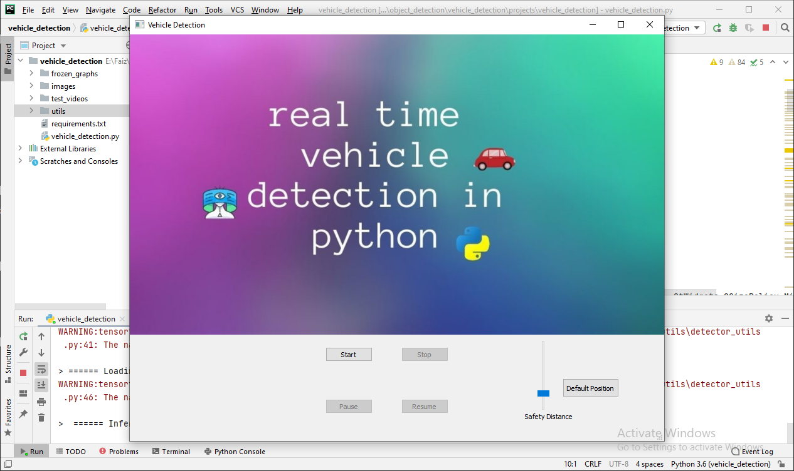
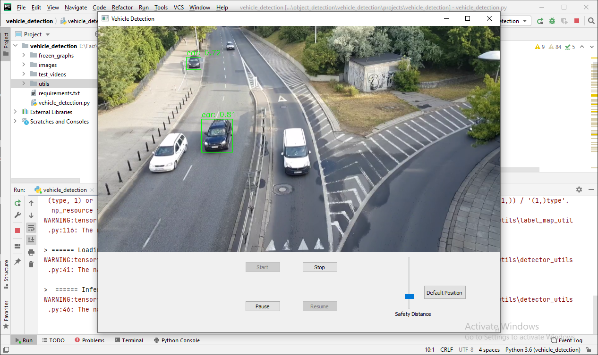
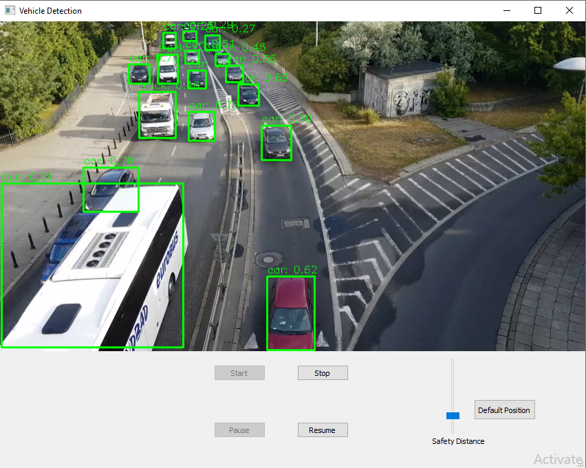

# vehicle_detection_pyqt_application

## overview
It is a vehicle detection application which is made using [PyQt5(GUI toolkit for python)](https://www.riverbankcomputing.com/software/pyqt/). It can detect 4 types of vehicles (Car, Bus, Truck, Motorclycle). In this project, I have also add a feature that is if two vehicles come close and cross a safety distance, those vehicles would be locate in a frame( I locate such vehicles with bounding box of red color and a line b/w them) which work on approximation not precisely because this feature requires exact information of what focal length or FOV(Field of view), height and angle of installed camera are, to work well. Unfortunately, I don't get that information, so, I have developed different method to find approximate distance b/w cars to just demonstrate my feature.

## Results

